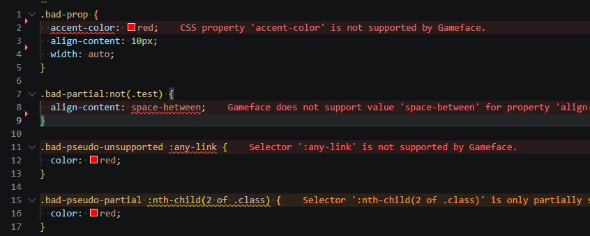

Install **ESLint** and **eslint-plugin-gameface**. The plugin ships with the HTML and CSS tooling its preset uses (`@html-eslint/eslint-plugin`, `@eslint/css`, and the TypeScript parser for `.ts` / `.tsx` files) - you do not install those separately.

```shell
npm install --save-dev eslint eslint-plugin-gameface
```

**Requirements:** 

* ESLint **9.15+** with [flat config](https://eslint.org/docs/latest/use/configure/configuration-files).
* Use Node.js `>=18.18.0` version. **We recomend to use latest versions of Node.js.**

After you [configure](/eslint-plugin-gameface/getting-started/configuration/) the plugin, you can verify its work from the terminal:

```shell
npx eslint .
```

You should see `gameface/...` messages on HTML, CSS, or JSX files that use unsupported Gameface features.

## VS Code (edit-time hints)



Terminal ESLint does not add squiggles in the editor by itself. For **inline diagnostics while you type**, install the [ESLint extension](https://marketplace.visualstudio.com/items?itemName=dbaeumer.vscode-eslint) (`dbaeumer.vscode-eslint`).

1. Install the extension from the VS Code Marketplace.
2. Ensure your project has `eslint.config.js` with the [recommended preset](/eslint-plugin-gameface/getting-started/configuration/).
3. Open an HTML, CSS, or JSX file—the Problems panel and editor underlines should show `gameface/` issues.

### Validate HTML, CSS, and other file types

By default, the ESLint extension mainly lints JavaScript and TypeScript. To run ESLint (and Gameface rules) **while you edit** `.html`, `.css`, `.scss`, and JSX/TSX files, add `eslint.validate` to your workspace or user settings.

Create or edit `.vscode/settings.json` in your project:

```json
{
  "eslint.validate": [
    "javascript",
    "javascriptreact",
    "typescript",
    "typescriptreact",
    "css",
    "html",
    "scss"
  ]
}
```

After that, reload the window or run **ESLint: Restart ESLint Server** command (`Ctrl + Shift + P`) to apply the new changes.

If nothing appears, check that ESLint is enabled for the workspace (Command Palette → **ESLint: Show Output Channel**) and that the file type is not excluded in VS Code or ESLint `ignores`.

Other editors (WebStorm, Neovim, etc.) have their own ESLint integrations; the same `eslint.config.js` applies.
