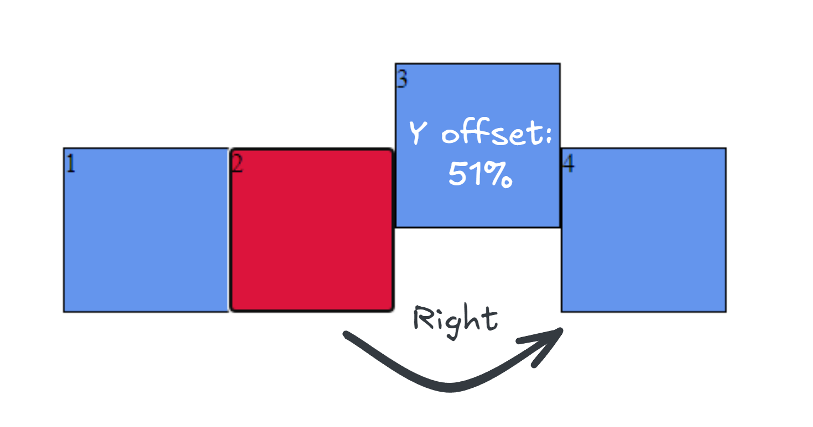

import { Badge } from '@astrojs/starlight/components'
import IMExample from '@components/IMExample.astro';

A JavaScript-based implementation for Spatial Navigation with gamepad support

## Basic implementation

```js
spatialNavigation.init(['.square']);
```

Click on an element and move the focus with your keyboard arrow keys: 

<IMExample path="/im-demo/demo/SpatialNavigation/grid-elements-focus.html"/>

If you add a `disabled` property to a navigatable element it will skip it when moving the focus

<IMExample path="/im-demo/demo/SpatialNavigation/grid-elements-disabled.html" height="700"/>

## API

### init([navigatableElement])

Initializes the spatial navigation.

#### navigatableElement

The `navigatableElement` can be:

##### 1. A string selector:

```js
spatialNavigation.init(['.square']);
```

##### 2. An HTMLElement reference: :badge[2.4.4]{variant="note"}

```js
const element = document.getElementById('myElement');
spatialNavigation.init([element]);
```

##### 3. A navigatableArea object:

```js
spatialNavigation.init([
    { area: 'square-1', elements: ['.square1'] },
    { area: 'square-2', elements: ['.square2'] },
]);
```

This will create different areas to separate the navigation. If you pass only selectors or HTMLElements directly, they will be saved to the default area.

<IMExample path="/im-demo/demo/SpatialNavigation/grid-elements-areas.html" height="700"/>

#### Overlap (optional)

The `init` method takes an optional second argument, `overlap`, which accepts a value between 0.01 and 1. The default value is 0.5 (50%). It specifies the percentage of acceptable overlap between the current element and the next potential element for navigation.

If you want the elements to overlap perfectly (without any offset) in order to navigate between them, set the overlap value to 1 (100%).

```js
spatialNavigation.init(['.square'], 1);
```

**If you set a value less than 0 or greater than 1, the default value (0.5) will be used**



In the following example, when navigating to the right, `square 3` will be skipped because it has a Y-offset of `51%`, and the overlap parameter was not specified when calling the `init` method (defaulting to 0.5, or 50%). By specifying an overlap value of `0.55`, `square 3` will be considered a valid target, and moving right will focus on `square 3`.

```js
spatialNavigation.init(['.square'], 0.55);
```

##### area

Type:

```js
type area = string
```

The name of the area you want to be navigatable

##### elements

Type:

```js
type elements = (string | HTMLElement)[]
```

An array of element selectors (strings) or HTMLElement references that will be navigatable in this area. You can mix both types in the same array.

### .deinit()

Removes the spatial navigation, listeners and actions.

### add([navigatableElements])

The same as `.init()` but only adds elements to areas and new areas. Use it after initialization.

Supports the same formats as `init()`: selector strings, HTMLElement references, or navigatableArea objects with mixed types.

```js
// Add selectors to default area
spatialNavigation.add(['.new-element']);

// Add HTMLElement references to default area
const newEl = document.getElementById('newItem');
spatialNavigation.add([newEl]);

// Add to named area with mixed types
const element = document.getElementById('sidebar-item');
spatialNavigation.add([
    { area: 'area-1', elements: ['.element', element] }
]);
```

### remove(area)

```js
type area = string
```

`default='default'`

Remove all of the elements from an area. It uses the area name as an argument, if you don't pass any arguments it will remove the elements from the default area.

```js
spatialNavigation.remove('area-1');
```

### focusFirst(area)

```js
type area = string
```

`default='default'`

Focuses on the first element of an area.

### focusLast(area)

```js
type area = string
```

`default='default'`

Focuses on the last element of an area.

### switchArea(area)

```js
type area = string
```

Switches to another area and focuses on the first element.

### clearFocus()

Unfocuses the currently focused element in a navigatable area.

### changeKeys()

```js
spatialNavigation.changeKeys({ up: 'W', down: 's', left: 'a', right: 'd' }, { clearCurrentActiveKeys: true });
```

The method accepts an optional options object as a last argument. The available options are:

* `clearCurrentActiveKeys` - Boolean. Defaults to `false`. If `true`, it clears all other keys except the provided ones. If `false` оr not specified the provided keys will just be added to the registered keys collection.

### resetKeys()

```js
spatialNavigation.resetKeys();
```

Resets the navigation keys to their default settings, restoring the key bindings to the standard navigation keys (arrow_up, arrow_down, arrow_left, arrow_right).

## Actions

The spatial-navigation registers actions that move the focus. You can use these from your code directly with

```js
action.execute('move-focus-down'); // moves the focus down
action.execute('move-focus-up'); // moves the focus up
action.execute('move-focus-left'); // moves the focus left
action.execute('move-focus-right'); // moves the focus right
```
