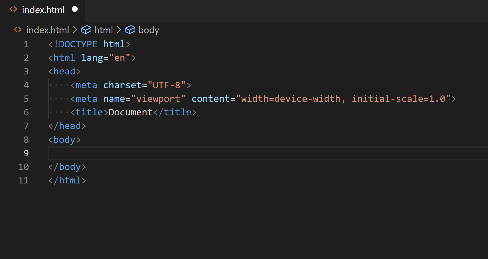
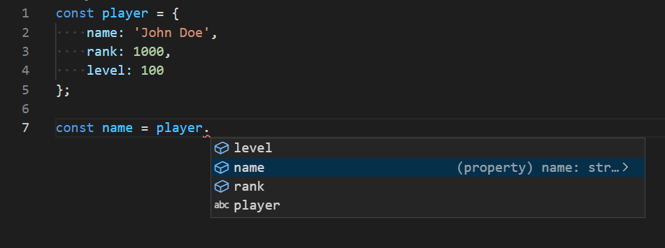

Auto complete is a feature of the code editors that suggests completions based on your current input. It is helpful, as it makes the writing faster and it reduces the errors caused by misspelled words. Some editors also provide IntelliSense - an intelligent auto-complete that suggests completions based on the current code context. It can suggest properties from objects, built-in language methods, global functions and [more](https://code.visualstudio.com/docs/editor/intellisense#_intellisense-features). Most modern code editors like [Visual Studio Code](https://code.visualstudio.com/), [Sublime Text](https://www.sublimetext.com/), WebStorm have built-in IntelliSense that supports the most popular programming languages.

