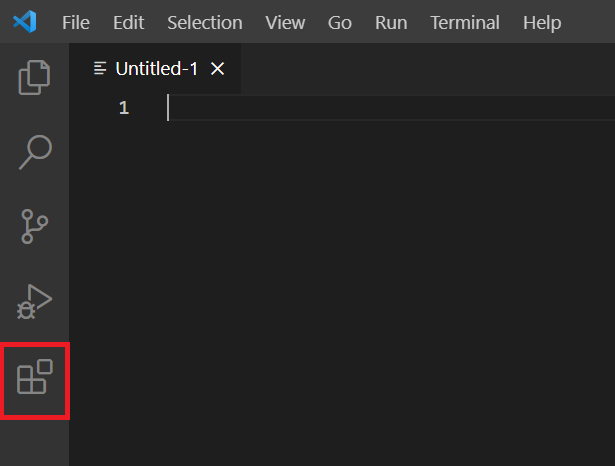
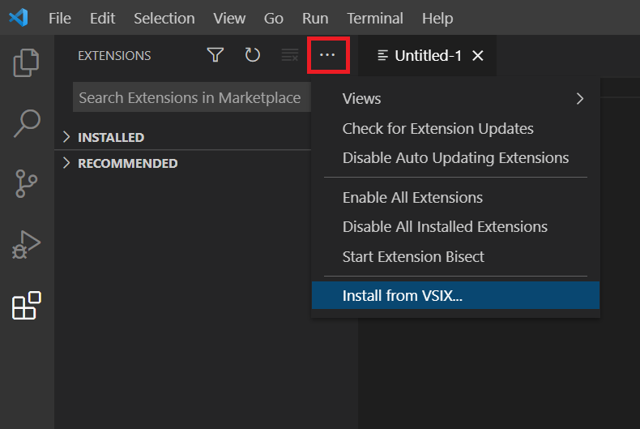
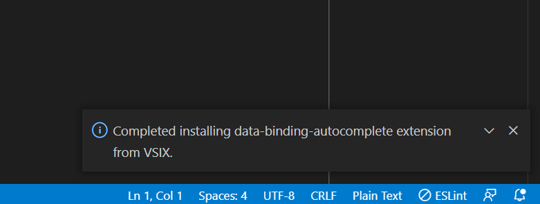
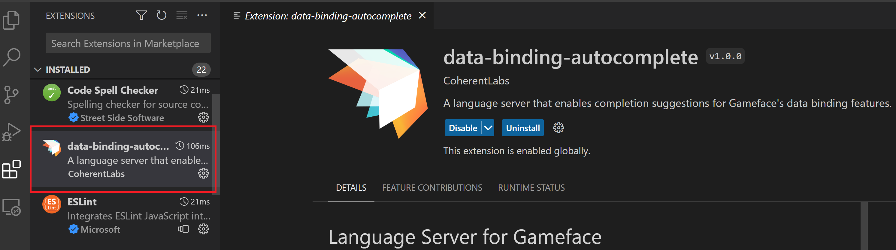
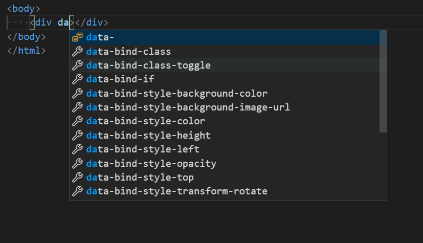

You'll need to install VSCode version `1.79.2` and above in order to be able to use the language server.

The language server extension is a `.visx` file - a VSCode extension bundle. To install it, first download the extension from the [downloads](../downloads) page and then open VSCode and click on the **Extensions** icon:

After that click on the **Views and More Actions** icon and choose the install from VISX option:

Locate the `.visx` file in the Gameface package and click **install**. You'll get a notification saying that the extension was successfully installed:

And the extension will appear on the extensions list:

VSCode might require a reload, but it will prompt you if it does.

Now, if you start typing `data-` the data binding suggestions will appear:

